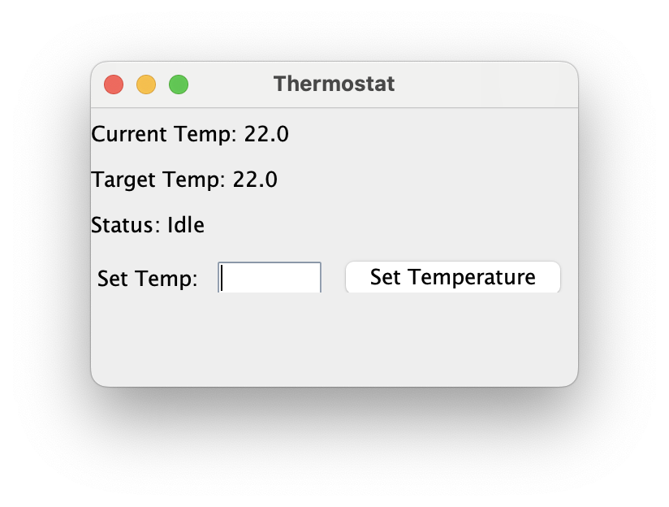
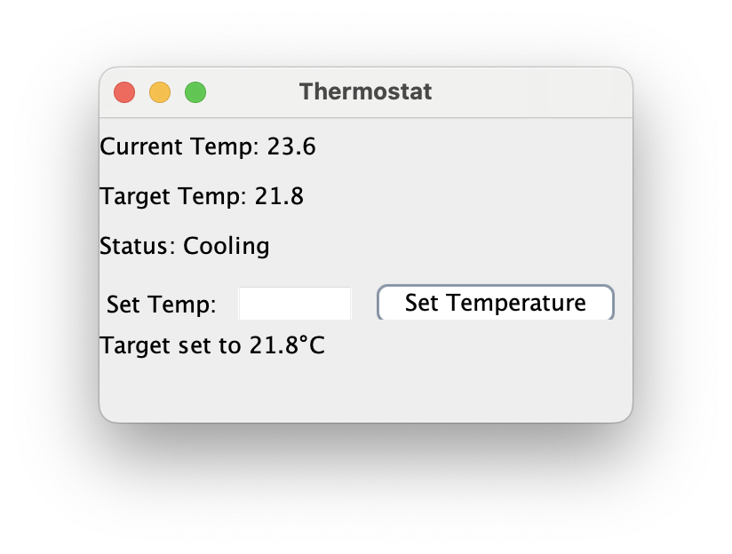

# Smart Thermostat Control System

A Java Swing application demonstrating **Object-Oriented Design principles** and the **Model-View-Controller (MVC)** architectural pattern through a thermostat simulation.

## 🎯 Project Overview

This project simulates a smart home thermostat system that automatically maintains a target temperature by controlling heating and cooling systems.





## 🏗️ Architecture & Design Patterns

### MVC Architecture
- **Model** (`ThermostatModel.java`): Manages temperature data and business logic
- **View** (`ThermostatView.java`): Handles user interface and display updates  
- **Controller** (`ThermostatController.java`): Coordinates user input and system updates

### Object-Oriented Design Principles Applied
- **Encapsulation**: Private fields with controlled access through public methods
- **Abstraction**: Clear separation of concerns between components
- **Single Responsibility**: Each class has one well-defined purpose
- **Loose Coupling**: Components interact through well-defined interfaces

## 🚀 Features

- **Real-time Temperature Simulation**: Automatic temperature adjustments every second
- **Smart Control Logic**: Heating/cooling activation based on temperature thresholds
- **User-Friendly GUI**: Clean Swing interface for temperature control
- **Input Validation**: Error handling for invalid temperature inputs
- **Status Monitoring**: Real-time display of system status (Heating/Cooling/Idle)

## 🛠️ Technologies Used

- **Java SE 8+**
- **Swing GUI Framework**
- **javax.swing.Timer** for real-time updates
- **Event-Driven Programming**

## 📦 Installation & Setup

### Prerequisites
- Java Development Kit (JDK) 8 or higher
- Any Java IDE (IntelliJ IDEA, Eclipse, VS Code)

### Running the Application
1. Clone the repository:
   ```bash
   git clone https://github.com/yourusername/thermostat-control-system.git
   cd thermostat-control-system
   ```

2. Compile the Java files:
   ```bash
   javac *.java
   ```

3. Run the application:
   ```bash
   java ThermostatApp
   ```

## 🎮 How to Use

1. **Launch the Application**: Run `ThermostatApp.java`
2. **Set Target Temperature**: Enter desired temperature in the input field
3. **Click "Set Temperature"**: The system will start automatically adjusting
4. **Monitor Status**: Watch real-time temperature changes and system status

## 🧠 System Logic

```
Temperature Control Algorithm:
├── If current temperature ≤ target - 0.09°C → Turn ON heating
├── If current temperature ≥ target + 0.09°C → Turn ON cooling  
└── If within tolerance range → System idle
```

## 🔧 Code Structure

```
src/
├── ThermostatApp.java          # Main application entry point
├── ThermostatModel.java        # Business logic and data management
├── ThermostatView.java         # GUI components and user interface
└── ThermostatController.java   # Event handling and coordination
```

## 🎯 Learning Objectives Demonstrated

- **MVC Pattern Implementation**: Clear separation of presentation, business logic, and control
- **Event-Driven Programming**: ActionListener implementation for user interactions
- **Timer-Based Updates**: Periodic system updates using Swing Timer
- **Input Validation**: Robust error handling for user input
- **Clean Code Practices**: Readable, maintainable code structure

## 🚀 Future Enhancements

<details>
<summary>Potential improvements for learning purposes</summary>

- **Strategy Pattern**: Different temperature control algorithms (Eco, Aggressive, etc.)
- **Observer Pattern**: Multiple temperature sensors and displays
- **Factory Pattern**: Support for different thermostat types
- **Data Persistence**: Save/load temperature history
- **Unit Testing**: JUnit tests for business logic
- **Configuration**: External settings file support

</details>

## 🤝 Contributing

This is an educational project, but suggestions and improvements are welcome! Please feel free to:

1. Fork the repository
2. Create a feature branch (`git checkout -b feature/improvement`)
3. Commit your changes (`git commit -am 'Add some improvement'`)
4. Push to the branch (`git push origin feature/improvement`)
5. Open a Pull Request

## 📝 License

This project is open source and available under the [MIT License](LICENSE).

## 👤 Author

**Your Name**
- GitHub: [@iamziqian](https://github.com/iamziqian)
- LinkedIn: [Violet's LinkedIn Profile](https://linkedin.com/in/violet-fu-ziqian)

---

*This project was created as part of learning Object-Oriented Design principles and software architecture patterns.*
